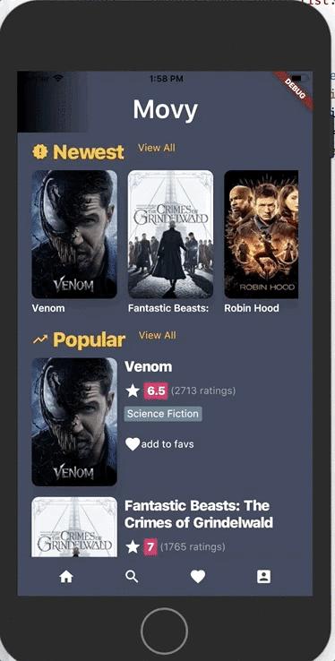

# Nue Kid to BLOC (Movy)

An App built to explore and understand Flutter and BLOC pattern through implementation of a movie app(Movy) that allows user to browse movies and mark them favorite. It's very much a WIP, and not very polished but it's getting there (I hope)

## Requires
- **[TMDB API key](https://github.com/one-aalam/new-kid-to-bloc/blob/a3fe802db39f57a42d667031ab9e012ebb008455/lib/src/resources/movie_api_provider.dart#L8)** which can be generated here: https://developers.themoviedb.org/ for pulling up the movie information
- A **[Firebase hosted DB](https://github.com/one-aalam/new-kid-to-bloc/blob/c9173ba82f97889dd8904dc7213c40d2a3e0da0d/lib/src/resources/movie_fav_service.dart#L9)** for retaining favorite information (one with the code has write access revoked)

## How it looks?

